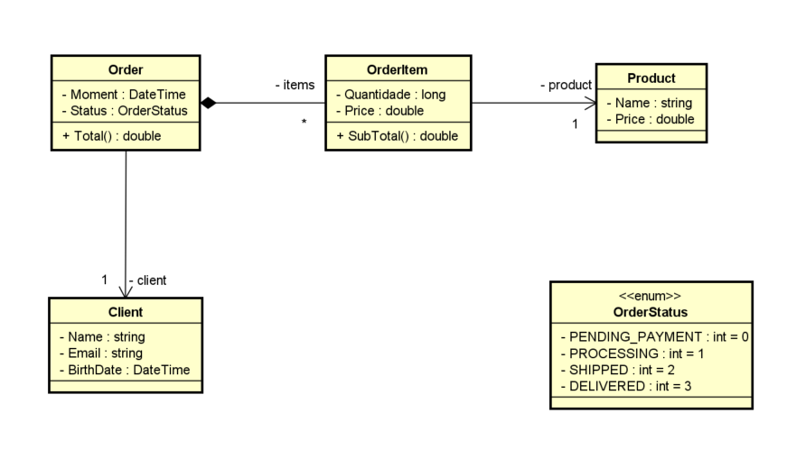

# 📝 Lista de Exercícios - Enumerações, Design e Composição (Aplicações Reais)

Esta lista foi elaborada com base em cenários comuns do mercado, focando em boas práticas de modelagem com enumerações, composição e design orientado a objetos.

---

## 🔹 Enumerações

### 1. Status de Pedido [Link](./exercicios/Ex01)

Crie uma enumeração `StatusPedido` com os valores: `AguardandoPagamento`, `Processando`, `Enviado`, `Entregue`.  
Modele uma classe `Pedido` com os campos: `Id`, `Cliente`, `Data`, `Status`.  
Implemente um programa que permita mudar o status de um pedido e mostre uma mensagem de acordo com o novo status.

### 2. Nível de Acesso [Link](./exercicios/Ex02)

Implemente uma enumeração `NivelAcesso` com: `Comum`, `Moderador`, `Administrador`.  
Crie uma classe `Usuario` com `Nome`, `Email` e `Nivel`.  
Implemente uma lógica que controle permissões com base no nível de acesso.

---

## 🔹 Composição e Design

### 3. Controle de Projetos [Link](./exercicios/Ex03)

Crie um sistema simples de controle de projetos com as seguintes classes:

- `Projeto`: `Nome`, `Descricao`, `DataInicio`, `DataFim`, `Responsavel` (objeto da classe `Funcionario`)
- `Funcionario`: `Nome`, `Cargo`, `Email`
  Mostre todos os projetos com os dados do responsável (composição).

### 4. Sistema de Pedidos (composição completa) [Link](./exercicios/Ex04)

Monte um sistema com as seguintes classes:

- `Cliente`: `Nome`, `Email`, `DataNascimento`
- `Produto`: `Nome`, `Preco`
- `PedidoItem`: `Produto`, `Quantidade`, `Preco`
- `Pedido`: `Cliente`, `Data`, `Status`, `Lista<PedidoItem>`

Adicione métodos para:

- Calcular subtotal de itens
- Calcular total do pedido
- Gerar resumo do pedido

Use composição para vincular todos os objetos entre si.

---

## 🔹 Desafios Realistas

### 5. Plataforma de Publicação de Conteúdo

Modele:

- `Autor`: `Nome`, `Bio`
- `Artigo`: `Titulo`, `Conteudo`, `DataPublicacao`, `Autor`
- `Comentario`: `Texto`, `Data`, `Autor`

Implemente:

- Uma lista de comentários em cada artigo
- Uma função para exibir artigo com seus comentários

### 6. Sistema de Controle de Funcionários com Departamento

- Crie `Departamento` com `Nome` e `Gerente`
- Crie `Funcionario` com `Nome`, `Cargo`, `Salario`, `Departamento`
- Implemente:
  - Listagem de funcionários por departamento
  - Cálculo da folha de pagamento por departamento

---

## ✅ Dicas

- Use boas práticas como encapsulamento, uso de propriedades, construtores e validações
- Prefira composição a herança, exceto quando claramente necessário
- Utilize enums para tornar o código mais semântico e evitar "valores mágicos"
