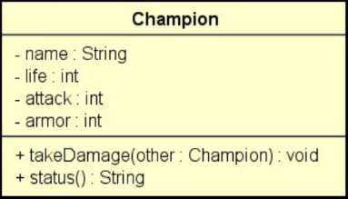

# 📝 Lista de Exercícios - POO Avançado em C#

Esta lista é voltada para a prática de construtores, encapsulamento, properties e membros com controle de acesso.

---

## 🔹 Construtores e Sobrecarga

1. Crie uma classe `Pessoa` com os atributos `Nome` e `Idade`. Implemente: [Link](./exercicios/Ex01)

   - Um construtor sem parâmetros
   - Um construtor com os dois parâmetros
   - Um método `Exibir()` que imprime os dados

2. Crie uma classe `Produto` com três construtores: [Link](./exercicios/Ex02)

   - Um sem parâmetros
   - Um com nome e preço
   - Um com nome, preço e quantidade

3. Crie uma classe `Livro` com os atributos `Titulo`, `Autor` e `Ano`. Implemente: [Link](./exercicios/Ex03)
   - Um construtor padrão
   - Um construtor que recebe todos os dados
   - Um método que retorna uma string formatada com os dados

---

## 🔹 Sintaxe Alternativa e Palavra `this`

4. Reescreva a classe `Produto` anterior utilizando inicialização via `this` nos construtores. [Link](./exercicios/Ex04)
5. Instancie objetos usando inicializadores de objeto (`new Produto { Nome = "...", ... }`). [Link](./exercicios/Ex05)

---

## 🔹 Encapsulamento e Properties

6. Crie uma classe `ContaBancaria` com: [Link](./exercicios/Ex06)

   - Atributos privados: `Numero`, `Titular`, `Saldo`
   - Properties públicas com regras: `Titular` pode ser alterado, `Saldo` só leitura
   - Método `Depositar()` e `Sacar()` com validações

7. Crie uma classe `Temperatura` com atributo privado `_celsius`: [Link](./exercicios/Ex07)
   - Property `Celsius` com validação (> -273.15)
   - Property somente leitura `Fahrenheit` que calcula com base no valor em Celsius

---

## 🔹 Auto Properties e Modificadores

8. Crie uma classe `Cliente` com auto-properties `Nome`, `Email` e `DataNascimento`. [Link](./exercicios/Ex08)
9. Reforce a visibilidade:
   - Use `private set` para impedir alteração direta de `DataNascimento`
   - Torne a classe visível apenas dentro do assembly (`internal`)
     [Link](./exercicios/Ex08)

---

## 🔹 Desafio Final

10. Em um jogo de combate, cada jogador joga com um campeão. Cada campeão possui um nome, uma quantidade de ataque, armadura e vida. O combate entre dois campeões é organizado em turnos, de modo que em cada turno, os dois campeões se atacam. Você deve fazer um programa para instanciar dois campeões, depois executar N turnos de combate, mostrando a cada turno o estado de cada campeão, conforme exemplos. Se em um turno um dos campeões morrer (quantidade de vida igual a zero), o combate deve terminar. Ao final do combate, mostrar na tela "FIM DO COMBATE".
    A regra para um campeão A receber dano de outro campeão B é a seguinte:

    - A quantidade de vida do campeão A deve ser decrescida da quantidade de ataque do campeão B, descontada a quantidade de armadura do campeão A. A quantidade de vida resultante não pode ser menor que zero.
    - Independente da quantidade de armadura do campeão A, pelo menos 1 de vida o campeão A deve perder.

    Você deve criar uma classe para representar o campeão, conforme projeto abaixo.

    

    O método takeDamage serve para fazer com que o campeão receba dano advindo do ataque de outro campeão, conforme regras acima.
    O método status deve retornar o nome e a situação de vida do campeão (inclusive com a palavra "morreu" se a vida estiver a zero).

    [Link](./exercicios/Ex10)
