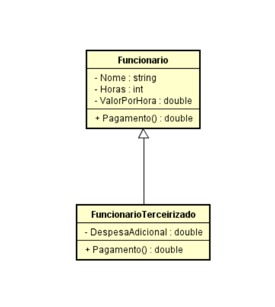

# 📝 Exercícios de Fixação - Herança e Polimorfismo em C#

Esta lista contém exercícios diretos e aplicáveis ao mercado, focando no uso realista de herança, polimorfismo e abstração em C#.

---

## 🔹 1. Sistema de Pagamento de Funcionários [Link](./exercicios/Ex01)

Você está construindo um sistema para calcular o pagamento de funcionários de uma empresa.  
Existem dois tipos de funcionário: comum e terceirizado.

### Requisitos:

- Crie uma classe `Funcionario` com: `Nome`, `Horas`, `ValorPorHora`, e método `Pagamento()`.
- Crie a subclasse `FuncionarioTerceirizado` com: `DespesaAdicional`, e sobrescreva `Pagamento()` para incluir um bônus de 110% sobre a despesa adicional.
- Leia os dados de N funcionários e exiba o nome e pagamento de cada um.

---

## 🔹 2. Etiqueta de Preço de Produtos

Construa um sistema para gerar etiquetas de produtos vendidos.

### Requisitos:

- Classe base `Produto` com: `Nome`, `Preco`, e método `EtiquetaPreco()`.
- Subclasse `ProdutoUsado` com: `DataFabricacao` (mostrar na etiqueta).
- Subclasse `ProdutoImportado` com: `TaxaAlfandega` (somar ao preço final).
- Para N produtos lidos, exiba suas etiquetas personalizadas.

---

## 🔹 3. Cálculo de Impostos

Um sistema de impostos deve calcular o valor a pagar por contribuintes.

### Requisitos:

- Classe abstrata `Contribuinte` com `Nome`, `RendaAnual` e método abstrato `Imposto()`.
- Subclasses:
  - `PessoaFisica`: possui `GastosSaude`. Paga 15% ou 25% de imposto com desconto nos gastos.
  - `PessoaJuridica`: possui `NumeroFuncionarios`. Paga 16% ou 14% dependendo da quantidade.
- Implemente leitura, cálculo e exibição do imposto de cada um.

---

Estes exercícios representam cenários comuns de negócios e reforçam o uso correto de herança, polimorfismo, override e classes abstratas em C#.
